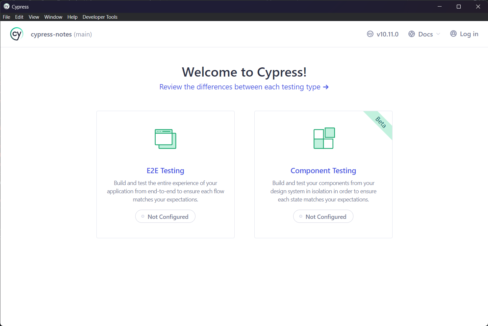
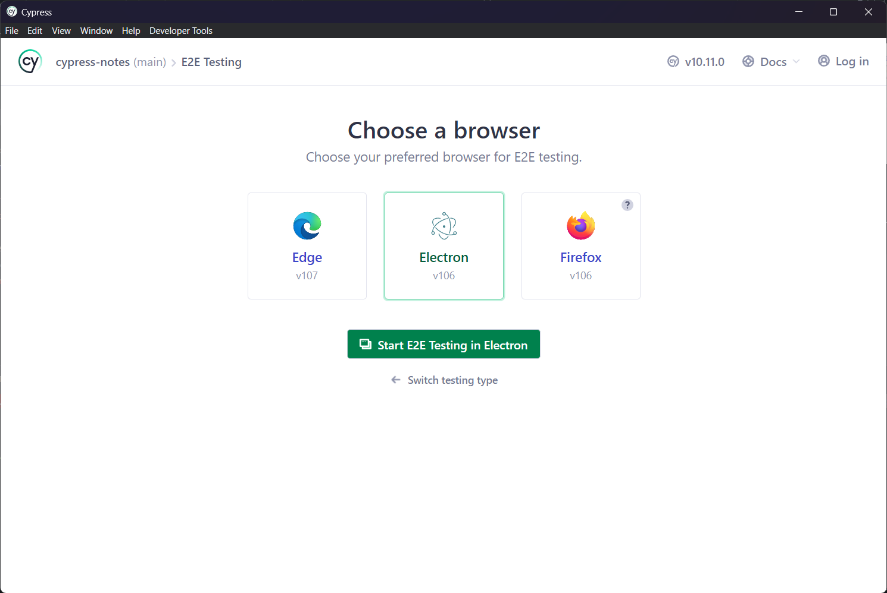
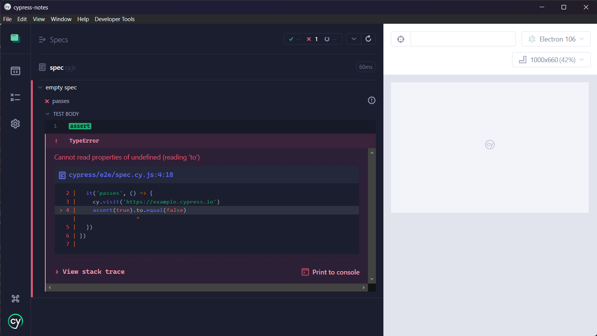

# Chapter 2: Cypress Hello World

- **created by**: Sudip Ghimire
- **URL**: [https://www.sudipghimire.com.np](https://www.sudipghimire.com.np)
- **Github**: [https://github.com/ghimiresdp](https://github.com/ghimiresdp)

## Table of Contents

- [Chapter 2: Cypress Hello World](#chapter-2-cypress-hello-world)
  - [Table of Contents](#table-of-contents)
  - [Cypress Test Runner](#cypress-test-runner)
  - [Types of Testing in Cypress](#types-of-testing-in-cypress)
    - [End-to-End Testing (E2E testing)](#end-to-end-testing-e2e-testing)
    - [Component Testing](#component-testing)
    - [API Testing](#api-testing)
    - [Other Testing](#other-testing)
  - [An example of End-to-End testing in Cypress](#an-example-of-end-to-end-testing-in-cypress)
    - [Writing the first E2E test](#writing-the-first-e2e-test)
      - [The `describe` block](#the-describe-block)

## Cypress Test Runner

Cypress Test runner is an interactive runner that allows you to see
commands as they execute. Test Runner consists of 5 basic components:

1. Test status menu
2. URL Preview
3. Control panel
4. Command log
5. App preview


The command log previews whatever test is running and the status of
currently running test. It shows nested view of each tests as well as
any command or assertion executed within the test block.

To know more about the test runner, we can check the link below:
<https://docs.cypress.io/guides/core-concepts/cypress-app#The-Test-Runner>

## Types of Testing in Cypress

Ref: <https://docs.cypress.io/guides/overview/why-cypress#Test-types>

### End-to-End Testing (E2E testing)

Cypress was originally designed to run end-to-end (E2E) tests on anything that
runs in a browser. A typical E2E test visits the application in a browser and
performs actions via the UI just like a real user would.

```js
it('adds todos', () => {
  cy.visit('https://todo.app.com')
  cy.get('[data-testid="new-todo"]')
    .type('write code{enter}')
    .type('write tests{enter}')
  // confirm the application is showing two items
  cy.get('[data-testid="todos"]').should('have.length', 2)
})
```

### Component Testing

Component testing refers to the testing of specific components that are used in
supported libraries or frameworks like React JS.

```jsx
import TodoList from './components/TodoList'

it('contains the correct number of todos', () => {
  const todos = [
    { text: 'Buy milk', id: 1 },
    { text: 'Learn Component Testing', id: 2 },
  ]

  cy.mount(<TodoList todos={todos} />)
  // the component starts running like a mini web app
  cy.get('[data-testid="todos"]').should('have.length', todos.length)
})
```

### API Testing

API Testing refers to the HTTP request which will return you the response
accordingly. It is similar to testing requests in
[Postman](https://www.postman.com/).

```js
it('adds a todo', () => {
  cy.request({
    url: '/todos',
    method: 'POST',
    body: {
      title: 'Write REST API',
    },
  })
    .its('body')
    .should('deep.contain', {
      title: 'Write REST API',
      completed: false,
    })
})
```

### Other Testing

Cypress supports a wide range of testing plugins through which you can test
hundreds of other components, libraries, and frameworks. please check
[Plugins directory](https://docs.cypress.io/plugins/directory) to know supported
testing plugins in cypress.

## An example of End-to-End testing in Cypress

> **ref**: <https://docs.cypress.io/guides/end-to-end-testing/writing-your-first-end-to-end-test>

To perform an E2E testing, we need to do the following procedure:

1. Open the cypress executable
2. Configure E2E Testing
3. Create a new empty spec
4. Add the test file

once you run your cypress executable with the `npx cypress open`
or `yarn run cypress open` command, you should see the following screen.
.

Once the cypress executable is open, you can simply press the `E2E Testing`
button to initialize your e2e test in your current workspace. This will add
the following files to your workspace:

```
📂 my-project
├──📃 cypress.config.js
├──📂 cypress
│   ├──📂 fixtures
│   │   └──📃 example.json
│   └──📂 support
│       ├──📃 commands.js
│       └──📃 e2e.js
...
```

After  E2E testing is configured, we can select our preferred browser to start
E2E testing.


Once the browser is selected, we can then create a new empty spec to start
writing our first test. This will create a new file `cypress\e2e\spec.cy.js`
which we can edit to add our test specifications.

### Writing the first E2E test

As creating an empty spec creates `cypress/e2e/spec.cy.js` file which contains
a sample test case, which is shown below:

```js
describe('empty spec', () => {
  it('passes', () => {
    cy.visit('https://example.cypress.io')
  })
})
```

#### The `describe` block

Here, the `describe()` function takes 2 arguments, i.e. name of the function and
a callback function. The `it()` function contains our actual test procedure. It
also takes 2 arguments which is similar to the `describe` block. the body of
`it()` function contains all the test cases. In the above example we added
`cy.visit()` which browses `https://example.cypress.io` and displays the page
in the browser window.

The code block above will visit <https://example.cypress.io> and the test will be
passed since there is nothing to assert.

If we try to assert something that should fail, then it will fail the test. For
example, if we add a line as shown below, then the test case will fail.

```diff
describe('empty spec', () => {
  it('passes', () => {
    cy.visit('https://example.cypress.io')
++  expect(true).to.be.equal(false)
  })
})
```



Similarly, if we write something that should pass, then it should again pass
all the tests. To test this, we replace the line
`expect(true).to.be.equal(false)` with `expect(true).to.be.equal(true)` as shown
below:

```diff
describe('empty spec', () => {
  it('passes', () => {
    cy.visit('https://example.cypress.io')
--  expect(true).to.be.equal(false)
++  expect(true).to.be.equal(true)
  })
})
```

here, the value `true` is asserted to `true` which means the expected value and
obtained values both are true hence the test passes.

for more lecture examples, please check:
[Chapter 2 Code Samples](https://github.com/ghimiresdp/cypress-notes/blob/main/cypress/e2e/c001-intro.cy.js).
